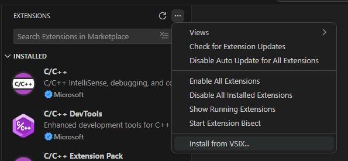

# goorm-ide

구름EDU를 VSCode에서 사용해보세요!  

## 설치법

1. 릴리즈에서 VSIX 파일을 다운받습니다.
2. 아래 사진을 따라 진행해주세요.

  

## 사용법

확장을 설치하면 작업 표시줄에 학사모 모양 아이콘이 생깁니다.  
클릭 후, 절차에 따라 진행해주세요.  

## 버튼 설명

  

줄 3개 버튼을 누르면 강좌를 선택할 수 있고, 오른쪽 화살표 버튼을 누르면 출석할 수 있습니다.  
